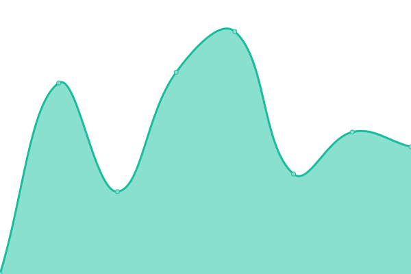

# [📈 Live Status](https://earthjasonlin.github.io/upptime): <!--live status--> **🟧 Partial outage**

This repository contains the open-source uptime monitor and status page for [Zichao Lin](https://earthjasonlin.cn), powered by [Upptime](https://github.com/upptime/upptime).

With [Upptime](https://upptime.js.org), you can get your own unlimited and free uptime monitor and status page, powered entirely by a GitHub repository. We use [Issues](https://github.com/earthjasonlin/upptime/issues) as incident reports, [Actions](https://github.com/earthjasonlin/upptime/actions) as uptime monitors, and [Pages](https://earthjasonlin.github.io/upptime) for the status page.

<!--start: status pages-->
<!-- This summary is generated by Upptime (https://github.com/upptime/upptime) -->
<!-- Do not edit this manually, your changes will be overwritten -->
<!-- prettier-ignore -->
| URL | Status | History | Response Time | Uptime |
| --- | ------ | ------- | ------------- | ------ |
|  [Blog](https://earthjasonlin.cn) | 🟥 Down | [blog.yml](https://github.com/earthjasonlin/upptime/commits/HEAD/history/blog.yml) | 

 0ms
     
 | 

<a href="https://earthjasonlin.github.io/upptime/history/blog">0.00%</a>
    

|  [Get](https://get.loliquq.cn) | 🟩 Up | [get.yml](https://github.com/earthjasonlin/upptime/commits/HEAD/history/get.yml) | 

 1323ms
     
 | 

<a href="https://earthjasonlin.github.io/upptime/history/get">98.19%</a>
    

|  [File](https://file.loliquq.cn) | 🟩 Up | [file.yml](https://github.com/earthjasonlin/upptime/commits/HEAD/history/file.yml) | 

 1140ms
     
 | 

<a href="https://earthjasonlin.github.io/upptime/history/file">98.19%</a>
    

|  [Git](https://git.loliquq.cn) | 🟩 Up | [git.yml](https://github.com/earthjasonlin/upptime/commits/HEAD/history/git.yml) | 

 1458ms
     
 | 

<a href="https://earthjasonlin.github.io/upptime/history/git">98.20%</a>
    

|  [Forge](https://code.loliquq.cn) | 🟩 Up | [forge.yml](https://github.com/earthjasonlin/upptime/commits/HEAD/history/forge.yml) | 

 1251ms
     
 | 

<a href="https://earthjasonlin.github.io/upptime/history/forge">98.20%</a>
    

|  [RSS](https://rss.loliquq.cn) | 🟩 Up | [rss.yml](https://github.com/earthjasonlin/upptime/commits/HEAD/history/rss.yml) | 

 1341ms
     
 | 

<a href="https://earthjasonlin.github.io/upptime/history/rss">98.20%</a>
    

<!--end: status pages-->

[**Visit our status website →**](https://earthjasonlin.github.io/upptime)

## 📄 License

- Powered by: [Upptime](https://github.com/upptime/upptime)
- Code: [MIT](./LICENSE) © [Anand Chowdhary](https://anandchowdhary.com), supported by [Pabio](https://pabio.com)
- Data in the `./history` directory: [Open Database License](https://opendatacommons.org/licenses/odbl/1-0/)
